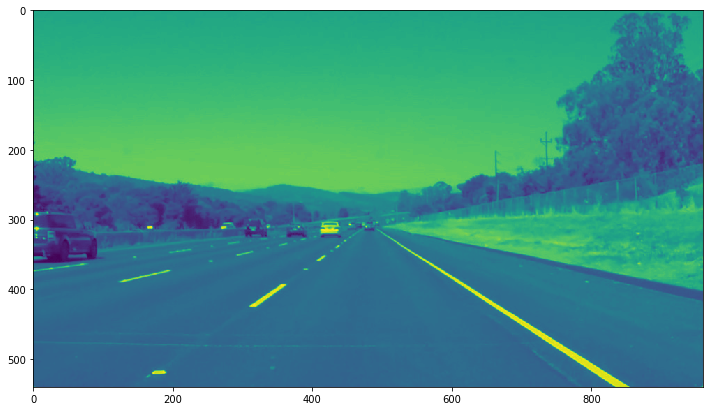

**Finding Lane Lines on the Road**

The goals / steps of this project are the following:

* Make a pipeline that finds lane lines on the road
* Reflect on your work in a written report

### Pipeline
#### 0. Take an Image (or Video Frame)


From this image we create two copies.  One using hsv color space (for the `cv2.inRange` functions, and a grayscale image (that I divide by two to create a subdued image) for the rest of the images.  (Subduing the image, along with the `gaussian_blur()` that we use in the Canny Edge Detector, helps clean out artifacts that can appear in the image.)

*Note:  All colors and numbers were found using trial and error as well as working with fellow students in the slack channel.*

#### 1. Mask out the colors
The first step I took was to mask out the colors I wanted.  I used an [openCV Colorspace Tutorial](http://docs.opencv.org/3.0-beta/doc/py_tutorials/py_imgproc/py_colorspaces/py_colorspaces.html#how-to-find-hsv-values-to-track) to get HSV values for white, and mostly white.  I did the same thing for Full Yellow and faded yellow.  Running both values through  `cv2.inRange()` created mask images based on the original that only had color values in the ranges supplied.  Using `cv2.bitwise_and` to get a mask including both yellow and white together, and finally oring with the grayscale image gives an image that 'brightens' the colors we care about in the grayscale range.  (Makes them whiter.)  

```python 
white_mask = cv2.inRange(hsv_image, lower_yellow, upper_yellow)
yellow_mask = cv2.inRange(hsv_image, lower_white, upper_white)
yellow_white_mask = cv2.bitwise_and(white_mask, yellow_mask)
masked_image = cv2.bitwise_or(subdued_gray, yellow_white_mask)
```

The resulting image looks like this:


#### 2. Canny Edge Detection
Next step is to run it through the canny edge detector.  As mentioned above, we first blur the image slightly using `cv2.GaussianBlur()` to smooth out some artifacts.

```python
kernel_size = 5
blurred_img = gaussian_blur(image,kernel_size)
```

Gives us a slightly blurred image:

  
Finally we run it through the Canny Edge Detector which uses `cv2.Canny()`.

```python    
canny_low_threshold = 50
canny_high_threshold = 150
canny(blurred_img,canny_low_threshold,canny_high_threshold)   
```

Now we have an image that looks like this:


#### 3. Crop out the Area of Interest
Now that we have an image that is very messy, we want to crop out whatever areas of the image the lines won't be in.  We know we want the bottom left (0, y), Near the middle of the screen (x*.475, y*.575), (x*.525, y*.575), and the bottom right of the screen (x, y).  We then use `cv2.fillPoly()` with our values to select out our region_of_interest.

```python
x = image.shape[1]
y = image.shape[0]
vertices = np.array([[(0,y),(x*.475, y*.575), (x*.525, y*.575), (x,y)]], dtype=np.int32)
region_of_interest(image, vertices)
```

Gets us a nice image of just the roadway.


#### 4. Apply the Hough Line Detection
Next we apply `cv2.HoughLinesP()` on the image to return an array of all lines detected.  Part of our `hough_lines()` function includes a `draw_lines()` function that takes the masked lines and creates a mask of the found lines.

```python
hough_rho = 3
hough_theta = np.pi/150
hough_threshold = 30
hough_min_line_length = 70
hough_max_line_gap = 155
return hough_lines(image,hough_rho,hough_theta,hough_threshold,hough_min_line_length,hough_max_line_gap)
```

This gives us just the lines:


#### 5. Clean up the Lines
The original Hough Lines array is filled with lots of messy lines which are all mostly correct but put together makes a messy image.  To clean this up, I first select lines that have a slope in specific ranges.  (Either sloping left or sloping right.)  

```python 
m = (y2-y1)/(x2-x1)
intercept = y1 - x1 * m
if (m > 0.15 and m < (0.15 * img.shape[1])):
    right_intercepts.append(intercept)
    right_slopes.append(m)
elif (m < -0.5 and m > -(0.15 * img.shape[1])):
    left_ints.append(intercept)
    left_slopes.append(m)
```

Next, we grab the average of both the slopes on intercepts for each side.

```python
right_slope_average = np.average(right_slopes)
right_intercepts_average = np.average(right_ints)
```

Finally, using the new slopes and intercepts, we draw a new line starting at the bottom of the screen and going up about 40% of the screen.  This seems to be good enough to draw the lanes and prevent the lines from crossing. 

```python
right_bottom_x = (img.shape[0] - right_int_average) / right_average
right_top_x = (img.shape[0] * 0.63 - right_int_average) / right_average
cv2.line(img, (int(right_bottom_x), img.shape[0]), (int(right_top_x), int(img.shape[0]*0.63)), color, thickness)
```

Now we have our cleaned up lines mask.


#### 5.5. Smooth out jitters in the line for video
As another effort to clean up the lines, I took the average of the average of the last 5 frames (5 seems to be a good compromise between smoothing out the jitters and preventing too much ghosting.)  This has really helped provide a smooth line that follows the actual lane lines pretty accurately.

```python
slide_length = 5
right_slopes_slide[frame % slide_length] = right_average
right_average = np.average(right_slopes_slide)
```

#### 6. Draw lines over original image.
Next, we take the mask of lines and draw it over our original image.


### Reflection
#### 1. Determining Values and Possible Shortcomings
The most difficult part of this project was 'intuiting' the values to be used in the functions.  Due to the quick turnaround of this project, I used values that were close to values provided in the classwork or given by fellow students.  Trial and error provided numbers that appear to work on all supplied images and videos.  While this works, I think there is a smarter way to figure these values out.  Values that can be determined at runtime to handle a wider range of brightness levels, road types, etc.  Also, I think being able to use the vehicle steering information would help determine how the image relates to our actions.  I also know that some students created tools to let them test values on the fly, which is also a great way to get numbers but doesn't allow on-the-road calibration.

#### 2. Possible Improvements
I thought about ways that would make this smarter.  Ideas include identifying the lines and then using the colors of the lines (in a sliding average of the last couple frames) to help lock in on the lines.

I also thought about running the process on stripes of the screen (bottom 10%, next 10%, etc) to detect curves.  These curves can then me tracked and followed through to help maintain positive line identification.

Finally, I thought it would be good to guess where a line should be based on other items.  For example, if the dashed line was missing, but the yellow line was identified, I can assume the dashed line should be x distance from the yellow line with a proper vanishing horizon point.